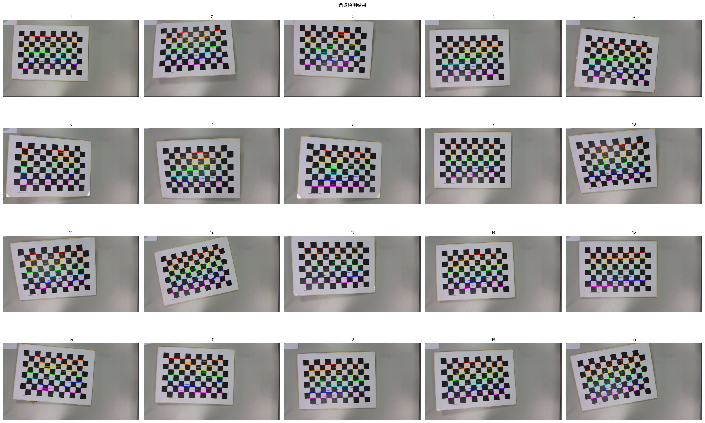
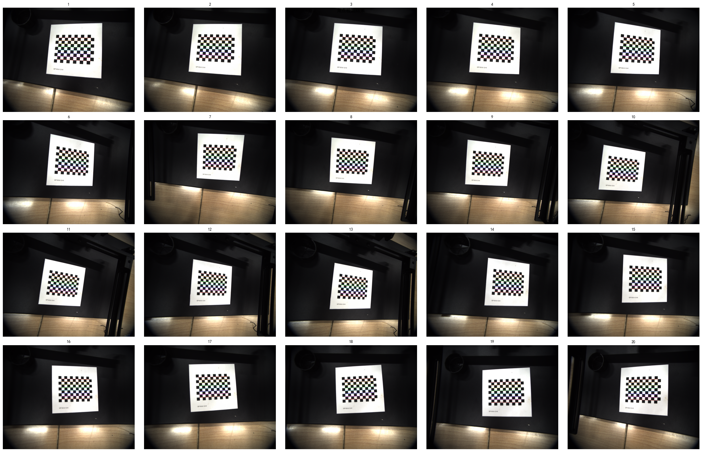
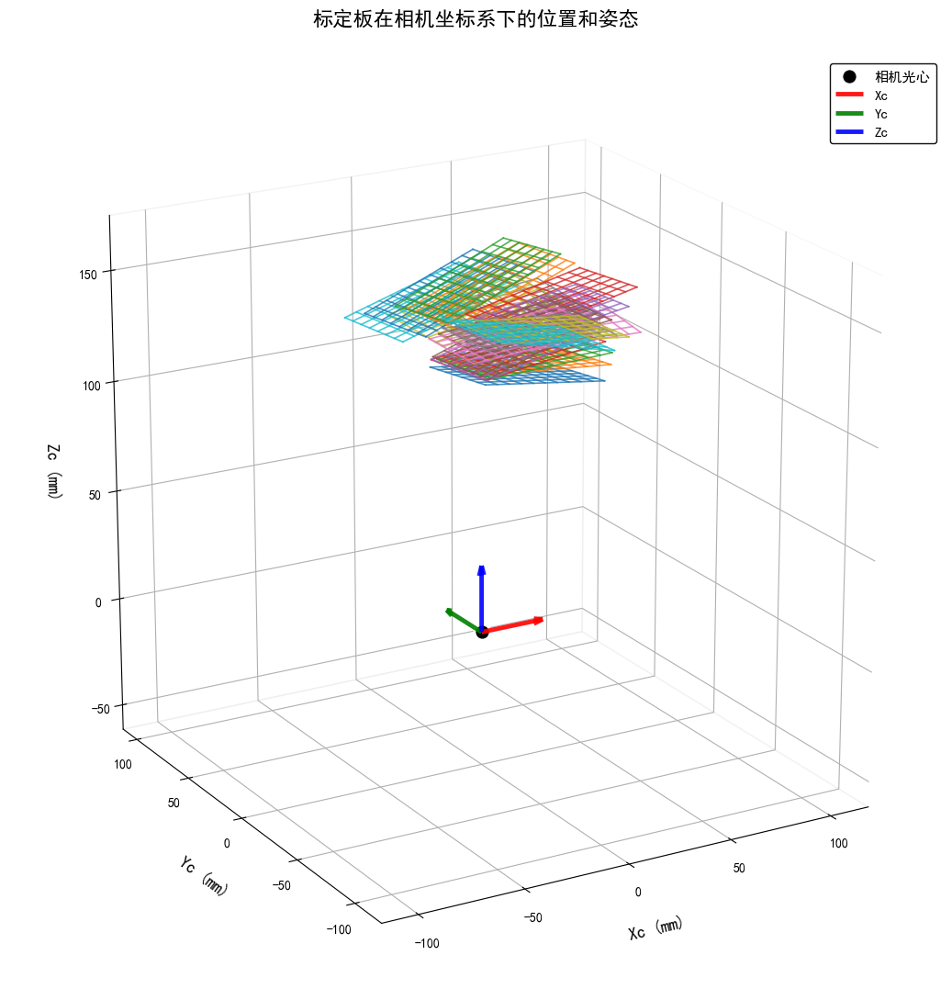
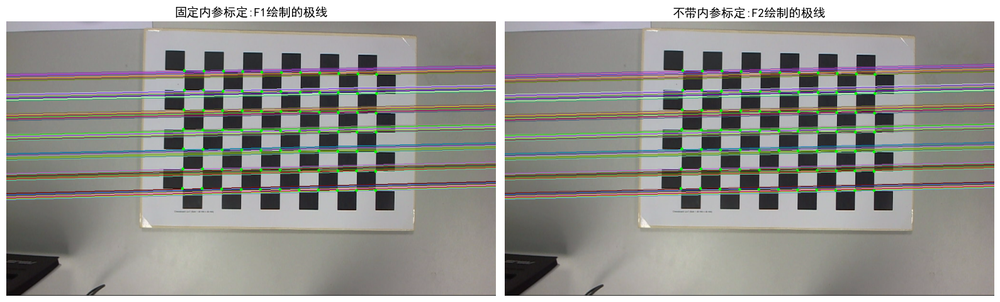
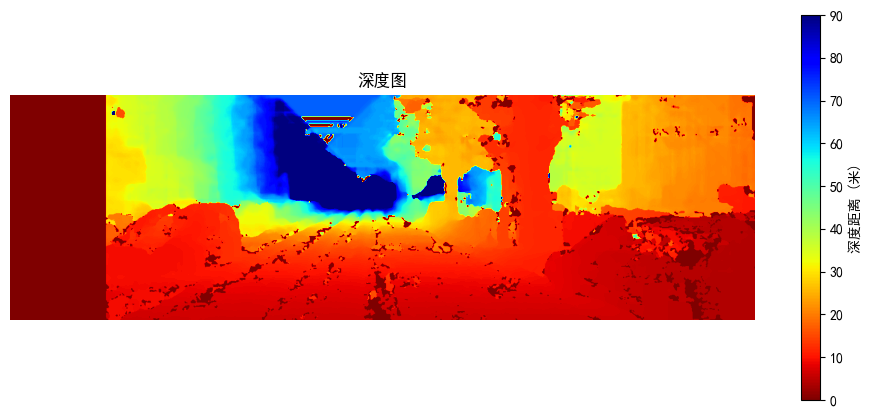
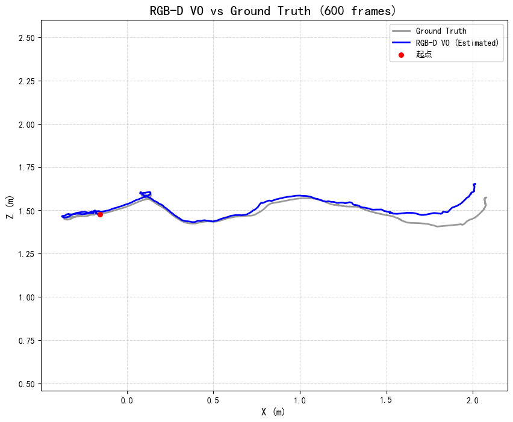
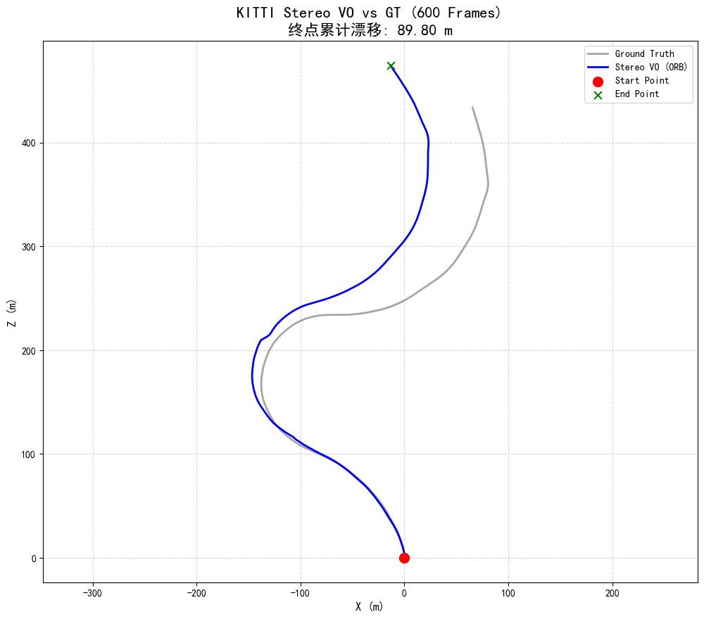

# 计算机视觉与 SLAM 课程实验

本仓库包含三类计算机视觉课程实验，涵盖单目相机标定、双目相机标定与三维重建、以及视觉里程计，所有代码均以 Jupyter Notebook 形式位于 `code/` 目录下。

---

## 目录结构

```
code/
├── monocular_camera_calibrate.ipynb              # 单目标定（标准数据集）
├── monocular_camera_calibrate_selfdata.ipynb     # 单目标定（自采数据）
├── stereo_camera_calibrate.ipynb                 # 双目标定 + 三维重建（完整版）
├── stereo_camera_calibrate_ extra_version.ipynb  # 双目标定（基础版）
├── visual_odometry.ipynb                         # 视觉里程计
└── output/                                       # 实验结果图像
data/                                             # 数据集（TUM、KITTI 等）
```

---

## 实验一：单目相机标定

**文件**：`code/monocular_camera_calibrate.ipynb` | `code/monocular_camera_calibrate_selfdata.ipynb`

基于张正友棋盘格标定法，利用 OpenCV 对单目相机进行内参标定（相机内参矩阵 $K$、畸变系数）。两个 notebook 分别对应不同数据来源：

| notebook | 数据来源 | 棋盘格规格 |
|---|---|---|
| `monocular_camera_calibrate.ipynb` | 标准数据集 | 25mm，内角点 11×7 |
| `monocular_camera_calibrate_selfdata.ipynb` | 实验室相机自采（20 张） | 6mm，内角点 11×8 |

**主要步骤**：角点检测与亚像素精细化 → 相机标定求解内外参 → 畸变校正效果可视化 → 重投影误差评估。

**代表性结果**：

| 角点检测 | 角点检测（自采数据） | 相机位置与姿态 |
|:---:|:---:|:---:|
|  |  |  |

---

## 实验二：双目相机标定与三维重建

**文件**：`code/stereo_camera_calibrate.ipynb` | `code/stereo_camera_calibrate_ extra_version.ipynb`

在单目标定基础上，进一步完成双目相机系统标定，求解两相机间的旋转矩阵 $R$、平移向量 $t$、本质矩阵 $E$ 与基础矩阵 $F$。

| notebook | 主要内容 |
|---|---|
| `stereo_camera_calibrate_ extra_version.ipynb` | 双目系统标定（基础版），输出内外参与极几何参数 |
| `stereo_camera_calibrate.ipynb` | 三种标定策略对比 + 极线绘制可视化 + 基于 KITTI 街景的视差图/深度图/点云三维重建 |

**代表性结果**：

| 极线绘制（标定后） | 极线对比（不同 flag） |
| :---:|:---:|
|  |  |

**KITTI 街景三维重建**（视差图 → 深度图 → 点云）：

| 视差图 | 深度图 | 三维点云 |
|:---:|:---:|:---:|
|  |  |  |

---

## 实验三：视觉里程计

**文件**：`code/visual_odometry.ipynb`

在 TUM 和 KITTI 数据集上实现并对比多种视觉里程计（VO）方案：

| 方案 | 数据集 | 方法 |
|---|---|---|
| 单目 ORB VO | TUM fr2 | ORB 特征点匹配 + 本质矩阵分解位姿 |
| 单目光流 VO | TUM fr2 | Lucas-Kanade 稀疏光流追踪 + 本质矩阵分解位姿 |
| 双目 VO | KITTI Sequence 09 | ORB 特征点 + 双目深度恢复尺度 |
| RGB-D VO | TUM fr2  | ORB 特征点 + 深度图获取真实尺度 |

**代表性结果**：

| RGB-D VO 畸变校正效果 | 双目 VO 轨迹（KITTI Seq.09） |
|:---:|:---:|
|  |  |

---

## 环境配置

```bash
# 依赖
Python >= 3.8
opencv-python
numpy
matplotlib
scipy
pandas
plotly
```

安装依赖：

```bash
pip install opencv-python numpy matplotlib scipy pandas plotly
```

---

## 运行方式

1. 克隆本仓库并准备数据集（TUM、KITTI）至 `data/` 目录；
2. 激活 Python 环境（推荐 conda）；
3. 用 VS Code 或 JupyterLab 打开 `code/` 下的 `.ipynb` 文件，按顺序逐单元格运行。

---

## 参考资料

- Zhang, Z. (2000). *A flexible new technique for camera calibration*. IEEE TPAMI.
- Bradski, G. (2000). *The OpenCV Library*. Dr. Dobb's Journal.
- Geiger, A. et al. (2012). *Are we ready for autonomous driving? The KITTI vision benchmark suite*. CVPR.
- Sturm, J. et al. (2012). *A benchmark for the evaluation of RGB-D SLAM systems*. IROS.
